# From a Camera Pose to a Robot Motion: How the Panda Tracker Works

This document explains, from first principles, what this project does and how
the code turns a stream of camera measurements into safe motion of a Franka
Emika Panda robot arm. It assumes no prior background in robotics, computer
vision, or control theory — every concept is introduced before it is used. It
is intended as a companion for writing a technical report on the project, and
it follows the actual code in `cpp/src/` and `cpp/include/panda_tracker/`
rather than a simplified textbook version.

---

## 1. The big picture

The system is a **Position-Based Visual Servoing (PBVS)** experiment. In plain
language:

1. An external tracking system (a camera, or any pose-estimation pipeline that
   produces a 3D pose) watches a physical object — called the **target** —
   and continuously estimates _where the target is relative to the camera_.
2. That estimate is sent over the network to a C++ program running next to
   the robot.
3. The program decides: "the target has moved, so the robot's end-effector
   (the flange/tool at the tip of the arm) should move to keep a desired
   spatial relationship with the target."
4. That decision is turned into a velocity for the tip of the robot, then into
   velocities for each of the robot's 7 joints, and finally streamed to the
   robot controller 1000 times per second.
5. A large set of independent safety checks can override or stop this motion
   at any point.

Nothing here controls the robot's _orientation_ — only its 3D position
(translation). Orientation tracking is intentionally disabled in this
experiment (see `PositionServo`, `map_translation_to_joint_velocity`).

The file [README.md](/README.md) shows the module dependency graph; this
report expands on _why_ each module exists and _what math_ it performs.

```mermaid
flowchart LR
    A[Tracker device\ne.g. camera] -- UDP packet --> B[tracker_receiver]
    B --> C[task_pose_protocol\ndecode + validate]
    C --> D[tracker_position_filter\nmedian + EMA + jump reject]
    D --> E[position_servo\ngeometry -> Cartesian error/velocity]
    E --> F[Cartesian rate limiter\nspeed/accel/jerk]
    F --> G[joint_velocity_mapper\nJacobian damped least squares]
    G --> H[Joint rate limiter\nspeed/accel/jerk]
    H --> I[robot_safety\nmonitors + speed scaling]
    I --> J[libfranka\nfranka::JointVelocities @ 1 kHz]
```

---

## 2. The language of robot geometry: frames and transformation matrices

### 2.1 Why we need "frames"

To describe _where something is_, you always need to say "relative to what?".
"The cup is 30 cm to the left" only makes sense once you fix an origin and a
set of axes — that fixed origin + axes is called a **coordinate frame**.

This project juggles several frames, each attached to a different physical
thing:

| Symbol | Meaning                                                                                                             |
| ------ | ------------------------------------------------------------------------------------------------------------------- |
| `B`    | Robot **base** frame — fixed to the robot's stand, doesn't move.                                                    |
| `F`    | Robot **flange** frame — attached to the tip of the robot arm.                                                      |
| `C`    | **Camera**/tracker frame — attached to the tracking sensor.                                                         |
| `T`    | **Target** frame — attached to the physical object being tracked.                                                   |
| `S`    | **Stick**/tool reference-point frame — a fixed offset from the flange used as the controlled point (`config.T_FS`). |

Every pose (position + orientation) reported anywhere in the code is really a
statement of "frame X, expressed in frame Y's coordinates". The code encodes
this directly in variable names, e.g. `T_CT` means _"the pose of frame `T`
(target), expressed in frame `C` (camera)"_. Reading the naming convention
`T_XY` as **"pose of Y as seen from X"** makes every formula in the codebase
readable without re-deriving it.

### 2.2 What a transformation matrix actually is

A **rigid transformation** (also called a _pose_ or an element of `SE(3)`) is
a combination of:

- a **rotation** `R` (a 3×3 matrix that only rotates, never stretches or
  mirrors — mathematically, `R` is orthonormal: `RᵀR = I` and `det(R) = 1`),
  and
- a **translation** `p` (a 3D vector, the offset between the two origins).

Both are packed into a single 4×4 **homogeneous transformation matrix**:

$$
T = \begin{bmatrix} R & p \\ 0\ 0\ 0 & 1 \end{bmatrix}
$$

The bottom row `[0 0 0 1]` is a bookkeeping trick: it lets you transform a 3D
point `x` by simply extending it to 4D as `[x; 1]` and multiplying:

$$
\begin{bmatrix} x' \\ 1 \end{bmatrix} = T \begin{bmatrix} x \\ 1 \end{bmatrix}
= \begin{bmatrix} Rx + p \\ 1 \end{bmatrix}
$$

so a single matrix multiply rotates **and** translates the point in one step.
This is exactly the `Transform` type in [geometry.h](/cpp/include/panda_tracker/geometry.h)
— a flat `std::array<double, 16>` storing this 4×4 matrix in row-major order
(the Franka/Eigen convention used by `libfranka` is column-major, which is why
[`franka_column_major_transform`](/cpp/src/geometry.cpp) exists purely to
transpose between the two storage orders — it does not change the geometry,
only the memory layout).

### 2.3 Composing and inverting transforms

Two operations recur throughout the code:

**Composition (chaining frames).** If you know the pose of `Y` in `X`
(`T_XY`) and the pose of `Z` in `Y` (`T_YZ`), you can get the pose of `Z` in
`X` by matrix multiplication:

$$ T*{XZ} = T*{XY} \cdot T\_{YZ} $$

This is [`multiply_transform`](/cpp/src/geometry.cpp) — literally a 4×4
matrix product. The project uses this to "walk" from one known relationship
to another, e.g. camera→target combined with target-side geometry to get
camera→stick.

**Inversion (flipping the direction of the relationship).** If you know
`T_XY` and want `T_YX` (the same physical relationship, described from the
other frame), you do **not** need a generic matrix inverse. Because rotation
matrices are orthonormal, the closed-form inverse is cheap:

$$ R^{-1} = R^\top, \qquad p\_{\text{inv}} = -R^\top p $$

This is exactly what [`invert_transform`](/cpp/src/geometry.cpp) computes: it
transposes the rotation block and re-projects the translation, rather than
running general-purpose Gaussian elimination on a 4×4 matrix.

### 2.4 Sanity-checking a transform

Because every incoming number ultimately comes from an external device over
the network, the code never assumes a received matrix is a valid rigid
transform. [`finite_rigid_transform`](/cpp/src/geometry.cpp) checks, in order:

1. Every entry is a finite number (no `NaN`/`Inf`).
2. The bottom row is exactly `[0, 0, 0, 1]` (within tolerance).
3. The rotation block's columns are mutually orthogonal and unit length
   (`RᵀR ≈ I`).
4. The determinant of `R` is `+1` (rules out mirror/reflection matrices,
   which would be physically impossible for a rigid body).

Only transforms that pass all four checks are trusted downstream.

### 2.5 Rotation error (`so3_log`), for completeness

[`so3_log`](/cpp/src/geometry.cpp) converts a rotation matrix into an
axis-angle vector (the "rotation vector" representation used to express _how
much and around what axis_ two orientations differ). It is provided as a
general geometry utility, but in the current position-only experiment it is
not fed into the control law — see §5, orientation control is deliberately
switched off.

---

## 3. What is being streamed: the tracker-to-robot protocol

### 3.1 What data crosses the network

The tracker device sends **one UDP packet per pose estimate**. Each packet
describes a single measurement: `T_CT`, the pose of the **target**, expressed
in the **camera** frame — i.e., "where is the tracked object, and how is it
oriented, relative to the tracking sensor, right now". Alongside the pose it
carries a **sequence number** (to detect drops/reordering/duplicates) and a
**confidence** value (a soft quality indicator, currently required to lie in
`[0, 1]`).

This is intentionally the _only_ thing streamed — no video, no velocities, no
robot state travels over this channel. The robot's own state (joint angles,
flange pose, forces) is read locally from `libfranka` at 1 kHz and never goes
over this UDP link.

### 3.2 The wire format: "PTP2"

The packet layout is defined in
[task_pose_protocol.h](/cpp/include/panda_tracker/task_pose_protocol.h) /
[task_pose_protocol.cpp](/cpp/src/task_pose_protocol.cpp) as a fixed-size,
148-byte binary structure:

| Offset (bytes) | Field       | Type             | Meaning                                               |
| -------------- | ----------- | ---------------- | ----------------------------------------------------- |
| 0–3            | magic       | 4 bytes `"PTP2"` | Identifies this as a task-pose-protocol-v2 packet.    |
| 4              | version     | `uint8`          | Must equal `2`.                                       |
| 5              | valid       | `uint8` (0 or 1) | Whether the sender considers this a good estimate.    |
| 6–7            | reserved    | `uint16`         | Must be zero (future-proofing / corruption check).    |
| 8–15           | sequence_id | `uint64`         | Monotonic counter, used to detect duplicate/old data. |
| 16–19          | confidence  | `float32`        | Quality score in `[0, 1]`.                            |
| 20–147         | T_CT        | 16 × `float64`   | The 4×4 transform, in row-major order (see §2.2).     |

This is a deliberately simple, self-describing binary protocol rather than a
text format (e.g. JSON): fixed size and fixed field offsets let the decoder
avoid any parsing/allocation on the hot path, which matters because this data
feeds a control loop.

### 3.3 Decoding and rejecting bad data

[`decode_task_pose`](/cpp/src/task_pose_protocol.cpp) is a strict decoder — it
fails closed. Every packet must pass **all** of the following before its pose
is trusted:

1. The host CPU is little-endian (the wire format assumes this; this project
   does not implement a byte-swapping path).
2. The received buffer is exactly 148 bytes.
3. The magic bytes equal `"PTP2"`.
4. The version byte equals `2`.
5. The `valid` byte is exactly `0` or `1` (any other value is treated as
   corruption, not as "extra information").
6. The reserved field is exactly zero.
7. The confidence is a finite float inside `[0, 1]`.
8. The 16 doubles decode into a matrix that passes `finite_rigid_transform`
   (see §2.4) — i.e., it is really a rotation + translation, not garbage.

If any check fails, decoding returns a specific `DecodeStatus` (e.g.
`kWrongMagic`, `kInvalidTransform`) instead of a pose, and the receiver simply
discards the packet — the control loop never sees an unvalidated number.

### 3.4 Receiving packets: `TrackerReceiver`

[`tracker_receiver.h`](/cpp/include/panda_tracker/tracker_receiver.h) /
`.cpp` wraps a UDP socket. On each call to `poll()` it:

- Reads any pending datagram (non-blocking).
- Optionally rejects packets whose **source IP** doesn't match an expected
  tracker address (`require_tracker_source_filter` in the config) — this
  guards against a stray or malicious device on the same network segment
  sending unsolicited pose packets.
- Runs the packet through `decode_task_pose`.
- Publishes the latest **valid** snapshot (pose + arrival timestamp + source
  address) for consumption by the rest of the pipeline, and keeps running
  counters of accepted/rejected/duplicate/wrong-source packets for
  diagnostics.

Nothing here blocks or sleeps: the real control loop calls `poll()` from a
dedicated worker thread on a fixed schedule (`worker_rate_hz`), decoupled from
the robot's 1 kHz real-time thread (see §7).

---

## 4. Cleaning up the received signal: the tracker filter

Raw tracker measurements are noisy (sensor noise, occasional bad detections,
network jitter). Before this signal is allowed to influence robot velocity,
[`TrackerPositionFilter`](/cpp/src/tracker_position_filter.cpp) processes it
in three sequential stages, applied only to the _translation_ part of `T_CT`
(orientation is not tracked in this experiment — see §5.1):

### 4.1 Stage 1 — De-duplication by sequence number

If the newly-arrived packet has the same `sequence_id` as the last one
processed, it is treated as "no new packet" rather than as a new
measurement. This prevents the same value being fed into the filter twice
just because the worker loop polled faster than the tracker publishes.

### 4.2 Stage 2 — Median filter (outlier rejection)

The last `median_window_samples` (default 5, must be odd and ≥ 3) raw
positions are kept in a sliding window. For each axis (x, y, z)
independently, the **median** value is computed. A median is far more robust
to a single wild outlier than an average: one bad detection out of five
samples cannot drag the median far, whereas it could dominate a plain mean.

### 4.3 Stage 3 — Exponential Moving Average (EMA) smoothing

The median value is then blended with the _previous filtered output_ using:

$$ \text{filtered}_k = (1-\alpha)\cdot \text{filtered}_{k-1} + \alpha \cdot \text{median}\_k $$

with `ema_alpha` (default `0.25`–`0.35` depending on config) controlling the
trade-off: a small `α` gives a smoother but more lagged signal; a large `α`
tracks changes faster but passes through more noise.

### 4.4 Stage 4 — Post-filter jump rejection

Even after median + EMA smoothing, the _change_ between this filtered output
and the previous one is checked against `max_filtered_jump_m` (e.g. 20–50 mm).
If the jump is larger than that, the sample is rejected
(`FilterUpdate::kRejectedJump`), and — importantly — the raw sample is also
removed from the median window so a single bad detection cannot poison future
medians either. This is a last-resort "this cannot be a real target motion at
this speed" guard, independent of the median/EMA smoothing.

### 4.5 Re-assembling a transform

Because orientation is not estimated/controlled here, the filter reattaches a
**fixed, precomputed rotation** (`fixed_R_CT_`, derived once from the desired
geometric relationship — see §5.2) to the filtered translation, producing a
full `Transform` (`FilteredCameraPose.T_CT`) for the rest of the pipeline to
consume. The filter also tracks how many samples were accepted, rejected as
jumps, or rejected as invalid — used both for arming logic (§7) and
diagnostics.

---

## 5. From a filtered camera pose to a desired robot velocity

This is the heart of the "servoing" in _Position-Based Visual Servoing_:
turning "where is the target, relative to the camera" into "how fast should
the robot's tip move, in the robot's own coordinates". This logic lives in
[`PositionServo`](/cpp/src/position_servo.cpp).

### 5.1 Why orientation is set aside

The tracker's pose estimate normally carries both position and orientation.
This project explicitly only closes the loop on **position**: the filter
locks orientation to a fixed reference rotation, and the servo law below
strips orientation out of the commanded correction before it becomes a
velocity. This is a deliberate scope reduction of the experiment, called out
directly in the header comments of `PositionServo` and
`map_translation_to_joint_velocity`.

### 5.2 Chaining frames to find the current tool-to-target relationship

Recall the frames from §2.1: `B` (base), `F` (flange), `C` (camera), `T`
(target), `S` (a fixed reference point rigidly attached to the flange, offset
by the constant transform `T_FS`, i.e. "stick").

Given the just-filtered camera measurement `T_CT` (target in camera), the
servo first flips it around (§2.3) to get "camera in target":

$$ T*{TC} = T*{CT}^{-1} $$

then chains it with the fixed camera-to-stick geometry `T_CS` (a calibration
constant from the config file, the physical offset between the camera and the
tool reference point) to obtain **where the stick currently is, relative to
the target**:

$$ T*{TS} = T*{TC} \cdot T\_{CS} $$

This is exactly the composition rule from §2.3: chain "target→camera" with
"camera→stick" to get "target→stick".

### 5.3 Computing the position error

The configuration also defines `T_TS_des`: the **desired** pose of the stick
relative to the target — i.e. "this is where the tool should sit, relative to
the tracked object, when the task is satisfied". The error between where the
stick currently is and where it should be, expressed in the stick's own
current frame, is:

$$ \Delta T*S = T*{TS}^{-1} \cdot T\_{TS,\text{des}} $$

Only the **translation part** of `ΔT_S` is kept (`translation_only(...)` in
the code) — any rotation component is explicitly discarded, consistent with
§5.1. This avoids a subtle bug: if you moved a rotational error to a different
reference point without removing it first, it would inject a spurious
translational error (a "lever arm" effect), because rotating around an offset
point produces apparent translation. Stripping rotation _before_ changing
reference points sidesteps this entirely.

### 5.4 Moving the error from the tool point to the physical flange

The controlled reference point `S` is not the same as the physical robot
flange `F` (there's a fixed calibration offset `T_FS`). The translation-only
error is re-expressed at the flange using another compose/invert chain:

$$ \Delta T*F = T*{FS} \cdot \Delta T*S \cdot T*{FS}^{-1} $$

and then applied on top of the robot's currently-known flange pose in the
base frame, `T_BF` (read from the live robot state), to get a **goal flange
pose in the base frame**:

$$ T*{BF,\text{goal}} = T*{BF} \cdot \Delta T_F $$

The position error actually used for control is simply the difference of the
translation components:

$$ e*B = p(T*{BF,\text{goal}}) - p(T\_{BF}) $$

— i.e., "how far, in base-frame X/Y/Z millimeters, does the flange need to
move right now".

### 5.5 Turning the error into a commanded velocity

Three shaping steps are applied to `e_B` before it becomes the velocity
handed to the next stage:

1. **Diagnostic bias** (optional, default zero): a constant offset added to
   the error purely to produce a visible, deliberate test motion; it is not
   part of normal PBVS behavior.
2. **Axis masking**: any axis not enabled in `control_axes` (X/Y/Z booleans in
   the YAML config, e.g. [position_tracking_xy.yml](/cpp/configs/position_tracking_xy.yml)
   enables only X and Y) has its error forced to zero — so that axis is never
   driven by the tracker at all.
3. **Proportional control law with saturation**:

$$ v*B = \text{clamp}\big(k_p \cdot e*{B,\text{active}},\ \|v\| \le v\_{\max}\big) $$

This is a simple **P-controller** (proportional control): velocity is
proportional to how far off-target the tool currently is, which naturally
slows down as the error shrinks (approaching zero smoothly rather than
overshooting sharply), and `clamp_norm` (§2) caps the speed to
`max_linear_speed_mps` regardless of how large the error is, preventing a
big, sudden tracker jump from commanding a violent motion.

The dedicated Z-axis "hold" behavior (§7) is a separate, simple proportional
loop that only runs when Z tracking is disabled, keeping the flange at its
startup height instead of letting it drift under gravity/compliance.

---

## 6. Turning a Cartesian velocity into a robot joint command

At this point the pipeline has a **desired 3D translational velocity of the
flange, expressed in the robot base frame** — but the robot is not actuated
directly in Cartesian space; it is actuated by commanding a velocity for
_each of its 7 joints_. Two more shaping/conversion steps happen before that.

### 6.1 Cartesian-space rate limiting

Before any inverse kinematics, the desired 3D velocity (packed into a 6D
"twist" with the last three, angular, components fixed at zero — recall
orientation is not controlled) is passed through `franka::limitRate()` with
configured **maximum speed, acceleration, and jerk** (`max_linear_speed_mps`,
`max_linear_acceleration_mps2`, `max_linear_jerk_mps3`). This produces a
smooth, physically realizable trajectory shape _before_ it ever reaches the
robot's joints — jerk limiting in particular avoids abrupt direction/speed
changes that would otherwise stress the mechanism or trip built-in robot
protections.

### 6.2 The Jacobian: relating joint speeds to tip speed

A robot's **Jacobian** `J` is a matrix that (locally, instantaneously)
relates joint velocities `q̇` (7 numbers, one per joint) to the resulting
Cartesian twist of the flange (6 numbers: 3 translational + 3 angular):

$$ \begin{bmatrix} v \\ \omega \end{bmatrix} = J\, \dot q, \qquad J \in \mathbb{R}^{6\times 7} $$

`model.zeroJacobian(franka::Frame::kFlange, state)` (from `libfranka`)
computes this matrix for the robot's _current_ joint configuration — it
changes every control cycle as the arm moves. Because orientation is not
controlled, only the **first 3 rows** of `J` — call this `J_v`, the
_translational Jacobian_, 3×7 — are used going forward.

### 6.3 Inverting the Jacobian: damped least squares

The robot has **7 joints** but only **3** translational degrees of freedom are
being controlled — the system is redundant (more unknowns than equations), so
there is no unique matrix inverse of `J_v`. Naively using a
pseudo-inverse can also blow up near _singular configurations_ (poses where
the arm temporarily loses the ability to move smoothly in some direction).

[`map_translation_to_joint_velocity`](/cpp/src/joint_velocity_mapper.cpp)
solves this with **Damped Least Squares (DLS)**, sometimes called the
Levenberg-Marquardt inverse:

$$ \dot q = J_v^\top \left(J_v J_v^\top + \lambda^2 I\right)^{-1} v $$

Concretely, the code:

1. Builds the 3×3 matrix $A = J_v J_v^\top + \lambda^2 I$ (`lambda` is
   `jacobian_damping`, a small constant like `0.005`–`0.05`).
2. Solves the 3×3 linear system $Ax = v$ using Gaussian elimination with
   partial pivoting (`solve_3x3`) — a 3×3 solve is cheap enough to do safely
   inside a hard real-time loop.
3. Recovers joint velocities as $\dot q = J_v^\top x$.

The damping term `λ²I` is what keeps the solution finite and well-behaved
even when `J_v J_v^\top` is close to singular — it trades a small amount of
tracking accuracy for numerical robustness, which is standard practice near
singularities in this kind of inverse-kinematics-at-velocity-level problem.
The resulting `q̇` is then re-projected through the _full_ Jacobian
(`jacobian_times_joint_velocity`) to report the actually-achievable twist, for
diagnostics and comparison against what was requested.

### 6.4 Joint-space rate limiting

The raw `q̇` from the DLS solve is not yet safe to send to the robot as-is —
it could still change too abruptly between control cycles. A **second**
`franka::limitRate()` call bounds each joint's velocity, acceleration, and
jerk against configured ceilings (`max_command_joint_speed_radps`,
`..._acceleration_radps2`, `..._jerk_radps3`), continuity-tracked against the
robot's own last commanded/desired joint state (`state.dq_d`, `state.ddq_d`).
This is a second, independent shaping stage from §6.1 — the first shapes the
Cartesian request, the second shapes the joint-space command that results
from mapping that request through a Jacobian that itself changes every
cycle.

### 6.5 Sending the command

The fully-limited 7 joint velocities are wrapped in a `franka::JointVelocities`
object and returned from the callback passed to `robot.control(...)`. This
callback runs inside a **1 kHz real-time control loop** owned by `libfranka`
— every millisecond, the entire chain in §4–§6 must have _already_ produced a
fresh number (it is actually computed slightly upstream, in a separate
non-real-time worker thread — see §7.1 — and handed across via a lock-free
mailbox, since a UDP-based tracker and its filtering cannot be guaranteed to
run at hard real-time itself). The control mode is
`franka::ControllerMode::kJointImpedance`, and the executable disables
`libfranka`'s own secondary rate limiter/low-pass filter
(`franka::kMaxCutoffFrequency`) because the signal has already been
rate-limited twice explicitly (§6.1, §6.4) — running it through a third,
implicit limiter would only add unwanted lag.

---

## 7. Keeping it safe: architecture and monitoring

### 7.1 Two threads, one mailbox

The system deliberately separates:

- A **non-real-time worker thread**, running at `worker_rate_hz` (e.g. 100
  Hz), that polls the UDP tracker socket, runs the filter (§4), and computes
  the desired Cartesian error/velocity (§5). Network I/O and filtering are
  not guaranteed to complete within a hard deadline, so they must never run
  inside the 1 kHz control callback.
- The **1 kHz real-time control callback** (§6.5), which only reads the
  latest published command from a lock-free "mailbox" (`AtomicServoCommand`,
  using a sequence-number/retry pattern to read a consistent snapshot without
  blocking), applies safety scaling, shapes it, maps it through the Jacobian,
  and sends the joint command.

Freshness is checked in both directions: the worker checks how old the last
_robot_ state snapshot is; the real-time loop checks how old the last
_servo command_ is (`command_timeout_s`) before trusting it.

### 7.2 Arming: don't move immediately

The robot does not start moving the instant a valid tracker packet arrives.
It must first see `arm_valid_packets` _consecutive, newly-accepted, fully
valid_ filtered packets (default 5–10) while every other gate (`ROBOT_STALE`,
`TRACKER_STALE`, `ERROR_LIMIT`, etc. — see the `gate` states in
`pbvs_robot_position.cpp`) is green, within `max_arm_wait_s`. This avoids
jumping on the very first, potentially-still-settling, filtered value.

### 7.3 `RuntimeSafetyMonitor`: a stack of independent guards

[robot_safety.h](/cpp/include/panda_tracker/robot_safety.h) /
[robot_safety.cpp](/cpp/src/robot_safety.cpp) run on every 1 kHz cycle and can
either **derate** (scale down the commanded speed smoothly) or **stop**
(trigger a controlled deceleration to zero) the motion. Checks include:

- **Startup travel envelope** — the flange must stay within `max_travel_m` of
  where it was when motion started, and within `max_rotation_travel_deg` of
  orientation (even though orientation isn't actively controlled, it is still
  monitored for drift).
- **Braking boundary** — motion heading further toward a soft travel limit is
  zeroed pre-emptively (`moving_toward_soft_travel_limit`), before the hard
  limit above is ever reached.
- **Joint speed limits** — both a conservative "starting" ceiling and a higher
  "running" ceiling on measured joint speed.
- **Joint torque / external joint torque / torque-rate limits**, each
  compared against configured per-joint arrays.
- **External wrench (force/torque) monitoring** — both raw and bias-corrected
  (a wrench bias is measured once at startup via `acquire_wrench_bias`, to
  cancel out any resting offset from mounted tooling), against both "raw" and
  "corrected" thresholds.
- **Tracker freshness / tracking-loss grace** — if the tracker signal goes
  stale, the robot doesn't stop instantly; it commands zero velocity for a
  grace period (`tracking_loss_grace_s`) in case the tracker recovers, and
  only truly stops the motion after that grace period elapses.
- **Robot-state / command freshness** — described above.
- **Communication success-rate** — `state.control_command_success_rate`, an
  indicator provided by `libfranka` itself, is checked against
  `min_control_command_success_rate`.

Each check that can _derate_ speed reports a normalized `derate_ratio` and
which quantity is closest to its limit, purely for diagnostics — safety
thresholds themselves are fixed, not adjusted based on this reporting.

### 7.4 Controlled stop

When any stop condition fires, the control callback does not simply return
zero once — it keeps commanding a decelerating trajectory (still passing
through the same rate limiters) until the joint velocities and the robot's own
desired joint velocities are both effectively zero, or until
`max_stop_time_s` elapses as a hard timeout, at which point it force-returns
`franka::MotionFinished` with a zero command.

---

## 8. Observability: telemetry for tuning and reporting

A background thread can write a CSV file (`--telemetry-csv`) recording,
at a configurable rate (`--telemetry-rate`, default 50 Hz), the entire chain
per sample: raw tracker position, filtered tracker position, computed error,
flange position, the _requested_ vs. _safety-scaled_ vs. _rate-shaped_ vs.
_actually achieved_ Cartesian velocity, external forces/torques, joint
torques, the active safety-derate source, and packet accept/reject counters.
[plot_pbvs_telemetry.py](/plot_pbvs_telemetry.py) visualizes this CSV — useful
both for tuning the filter/controller gains and for producing figures for a
report (e.g. "commanded vs. achieved velocity" plots that show how much the
rate limiters and Jacobian damping affect tracking).

---

## 9. Summary: the full pipeline in one pass

1. **Sense**: an external tracker estimates `T_CT` (target pose in the camera
   frame) and sends it as a signed, versioned, fixed-size UDP packet (PTP2).
2. **Validate**: the packet is checked for correct size/magic/version/flags,
   plausible confidence, and a mathematically valid rigid transform, before
   being trusted at all.
3. **Denoise**: the translation is de-duplicated by sequence number, median
   filtered, EMA-smoothed, and checked for implausible jumps.
4. **Geometry**: the filtered camera-to-target pose is chained through fixed
   calibration transforms (`T_CS`, `T_FS`) and combined with the robot's
   current flange pose (`T_BF`) to compute a 3D position error of the flange
   in the base frame, relative to a configured desired target-relative pose.
5. **Control law**: the error becomes a desired Cartesian velocity via a
   proportional gain, axis masking, and a hard speed cap.
6. **Cartesian shaping**: the velocity is rate-limited (speed/accel/jerk).
7. **Inverse kinematics**: a damped-least-squares solve over the
   translational Jacobian converts the Cartesian velocity into 7 joint
   velocities.
8. **Joint shaping**: those joint velocities are rate-limited again
   (speed/accel/jerk), continuity-tracked against the robot's own state.
9. **Safety**: independently, a battery of monitors can scale down or zero
   the commanded velocity, or trigger a controlled stop, at any stage.
10. **Actuate**: the final joint velocities are sent to `libfranka` as
    `franka::JointVelocities`, once per millisecond, for as long as the
    robot's real-time control loop runs.
